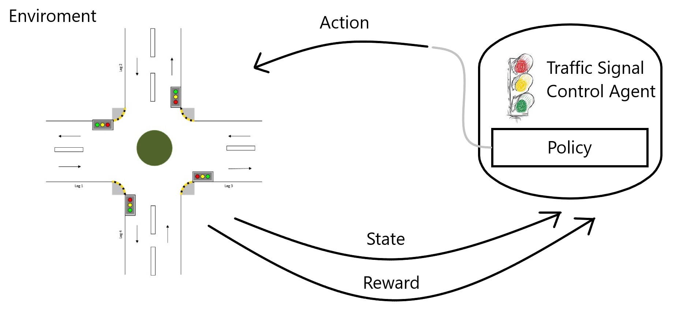

# Controlador dinámico de semáforos usando reinforcement learning
### Código del projecto: TSCRL
### Integrantes: Juan Martín Morales
   

## Introducción

Los semáforos son el principal árbitro para gestionar tráfico en intersecciones, y actualmente la gran mayoría tienen una programación con ciclos fijos que han sido determinados gracias a información histórica o mediante alguna estrategia particular. Además estos no tienen en consideración el tráfico en tiempo real y debido a esto la eficiencia del tráfico es baja. Una mala gestión del tráfico puede causar numerosos problemas, tales como retrasos en los conductores, un gran desperdicio de energía, mayores emisiones de carbono y de óxidos nitrosos, los cuales empeoran la calidad del aire, y también accidentes de tráfico.  

## Solución

La idea principal para reducir las problemáticas descritaas, es controlar las luces de los semáforos, seleccionando dinámicamente la mejor acción posible frente al tráfico actual. Para esto propongo utilizar una metodología de reinforcement learning, dónde el agente será el controlador de semáforos y el entorno estará modelado como un proceso de decisión de Markov, el cuál está representado por $< S,A,P,R >$, dónde $S$ es el espacio de estados, $A$ es el espacio de acciones, $P$ es la función de probabilidad de transición de estados y $R$ es la función de recompensas.  

El algoritmo a utilizar será Q learning, y de forma tentativa, también se intentará resolver mediante Deep Q Network.

La eficiencia de la metodología utilizada se hará utilizando la siguiente métrica,
$$AVG\_{Wt}={\frac{1}{n}}{\sum_{i=1}^{n} w_{i,t}}$$

dónde $w_{i,t}$ es el tiempo de espera del vehículo $i$ en el instante $t$.

### Características del agente modelo

+ Agente: el controlador de semáforos de la intersección.

+ Estados: información de la **posición**, **velocidad**, **tiempo de espera** de cada vehiculo en la intersección y las **señales** actuales de los semáforos.

+ Acciones: el controlador seleccionará la duración de cada fase  . Si la intersección tiene 4 calles de doble mano cada una, dicha intersección tendrá 4 semáforos.

+ La política de control se obtiene mapeando desde los estados del tráfico hacia las acciones de control "óptimas".

+ Recompensa: las recompensas que obtendrá el agente serán en base a los tiempos de espera de los vehículos (en principio.)

## Justificación
   
Para gestionar adecuadamente el tráfico en una intersección es necesario construir un modelo que nos permita preveer la evolución del tráfico, al menos a corto plazo, contemplando todas las variables significantes. Una solución que considero apropiada es la de ajustar dinámicamente las señales de los semáforos en base al tráfico actual. Gracias a algoritmos de reinforcement learning, tales como Q-learning y Deep Q-Network, podemos aprender satisfacer adecuadamente lo planteado.

## Listado de actividades a realizar
   

## Referencias
[Deep Reinforcement Learning for Traffic Light Control in Vehicular Networks](https://arxiv.org/abs/1803.11115)   

[A Deep Reinforcement Learning Approach for Fair Traffic Signal Control](https://www.researchgate.net/publication/353375159_A_Deep_Reinforcement_Learning_Approach_for_Fair_Traffic_Signal_Control)

[IEEE ITSC‘20 Tutorial - Deep Reinforcement Learning for Traffic Signal Control (slides)](https://docs.google.com/presentation/d/12cqabQ_V5Q9Y2DpQOdpsHyrR6MIxy1CJlPmUE3Ojr8o/edit#slide=id.p)
