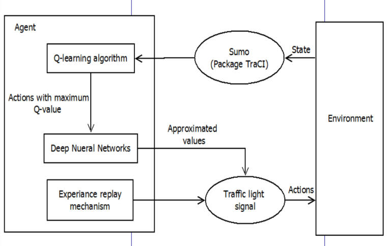
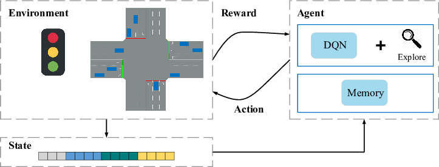
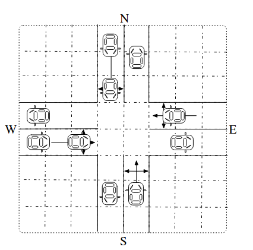

# Borrador. Reinforcement Learning for Traffic Signal Control

## Descripción

Optimizar tiempos de espera de los vehículos, mediante una política "justa" tanto como para el conjunto total de vehículos como para el individuo.

Para extrar información de la intersección del semáforo y enviar ordenes para cambiar los tiempos del semáforo usaré las APIs de **Python** proporcionadas por **SUMO**.

## Posibles características del método utilizar. 

### Agente/s  

+ Sistema Agente monolítico. Semáforos bajo el control de un sistema centralizado.

+ Sistema Multi-Agente. Compuesto por un conjunto de semáforos comunicados entre sí (total o parcialmente) dentro del mismo entorno.

### Algortimos.
+ Q-Learning
+ Q-Deep-Learning

## Posible Workflow del sistema de control de tráfico

## Modelos de tráfico

+ Macroscópico:  
    + los modelos describen relaciones entre la velocidad, densidad y flujo.
    + Análogo a fenómenos físicos. como dinámica de fluidos.  
         
+ Mesoscópico:  

    + los vehículos viajan en "paquetes" homogéneos.  

       

+ Microscópico:
    + en cada paso la velocidad y posición de cada vehículo es recalculada.

**Nagel schreckenberg model**. Modelo microscópico 1-D

## Diseño del entorno

+ Estados

    Por cada vehículo:  
    + Posición
    + Velocidad

    

+ Acciones

+ Recompensas

## Métricas

+ Tiempo de espera promedio

+ Tiempo de espera por vehículo

+ Cantidad de veces que se detiene un vehículo ($|V_i|=0$)

