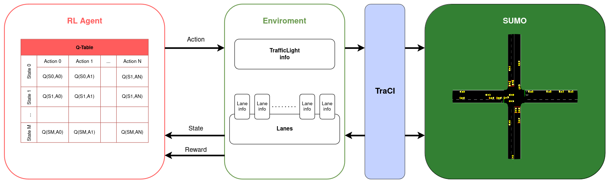

# Traffic Signal Controller Reinforcement Learning (TSCRL)

## Introducción
El volumen de tráfico vehicular en las ciudades cada vez ha sido mayor, lo cual ha producido numerosos problemas, el principal: las **congestiones**. Muchas redes de calles fueron planificadas teniendo en cuenta determinados flujos de tráfico, los cuales han sido superados a creces. Es posible replanificar parcialmente ciertas áreas de una ciudad, expandiendo calles y avenidas, cambiando el sentido de estas, agregando semáforos; sin embargo estas son soluciones estáticas.

Las congestiones en ciudades tienen los siguientes problemas asociados: incremento en los **tiempos de viaje**, aumento en el número de **detenciones** (aceleraciones y desaceleraciones) y como consecuencia una mayor **emisión** de **gases nocivos para la salud** ($CO$, $CO_2$, $NOx$, $HC$). En la [Figura 1](#avgTravelTimeToWork) se puede observar el incremento en los tiempos de viaje, a lo largo de los años en Estados Unidos. 

  
  
<i>Figura 1:</i> Evolución anual del tiempo de viaje al trabajo promedio (en minutos), en los Estados Unidos.

Adicionalmente, muchas ciudades utilizan semáforos con programaciones estáticas, lo cual resulta en una inflexibilidad notable en la gestión del tráfico. Esto puede provocar situaciones como la siguiente: en una intersección de dos calles, donde el flujo mayoritario proviene del este y del oeste, puede ocurrir que, de repente, aumente significativamente el número de vehículos provenientes del norte, superando a los demás. Dado que el semáforo tiene fases de tiempo fijo y prioriza la calle este/oeste, la gestión del tráfico se vuelve ineficiente e inflexible. Otra situación puede ser cuando solo hay vehículos ingresando a la intersección desde un carril, y los conductores se encuentren con un semáforo rojo, cuando no hay otros vehículos aproximandose a la intersección. Los semáforos con ciclos fijos, se han vuelto incapaces de adaptarse dinámicamente a las situaciones de tráfico, lo cual impacta negativamente en los tiempos de espera de los vehículos.

Una forma de abordar este problema es mediante el *framework* del *Reinforcement Learning* (aprendizaje por refuerzo). En este contexto, el controlador de semáforos actúa como un agente que interactúa con un *entorno* a través de *acciones*. Estas acciones son seleccionadas en función del *estado* actual del entorno (tráfico) y una *recompensa* proporcionada por este. La *recompensa* es un valor numérico que indica cuán efectiva fue la acción elegida.

En este trabajo, se utilizó un simulador de tráfico para modelar el entorno (tráfico en intersección de avenidas). Posteriormente, se entrenó al controlador de semáforos empleando el algoritmo Q-Learning. El objetivo fué optimizar la gestión del tráfico en comparación con los semáforos de ciclo fijo, específicamente reducir el tiempo de espera promedio de todos los vehículos que ingresaron a la intersección.

## Marco teórico

### Reinforcement Learning (RL)
El aprendizaje por refuerzo (reinforcement learning, en inglés) consiste en mapear situaciones (estados) a acciones, con el objetivo de maximizar una señal de recompensa numérica. En el marco del aprendizaje por refuerzo, existen dos elementos esenciales: uno o más agentes y un entorno.

El agente es el tomador de decisiones, al cual no se le indica explícitamente qué acciones tomar, sino que debe descubrir cuáles acciones generan más recompensas a través de la exploración y la experimentación. Generalmente, las acciones pueden afectar no solo la recompensa inmediata, sino también el estado siguiente y, a través de este, todas las recompensas futuras.

El otro elemento es el entorno, que representa el escenario con el que interactúa el agente. Este entorno debe modelarse (mediante abstracción) de tal manera que la interfaz de comunicación que ofrezca al agente contenga lo esencial para computar el proceso de aprendizaje. Para modelar este entorno usamos ideas de la teoría de sistemas dinámicos, específicamente de los procesos de decisión de Markov.

### Markov Decision Process (MDP)

Los Procesos de Decisión de Markov (Markov Decision Process, en inglés) son una formalización clásica de la toma de decisiones secuencial donde las acciones no sólo influyen en las recompensas inmediatas, sino también en situaciones posteriores, o estados, y a través de ellas en las recompensas futuras. Los MDPs pretenden ser una forma matemáticamente idealizada del problema del Reinforcement Learning para el que pueden hacerse afirmaciones teóricas que nos ayudan en lo práctico. 

En un MDP, el agente y el entorno interactúan en cada uno de una secuencia de pasos temporales discretos, $t = 0, 1, 2, 3, ...$. En cada paso de tiempo $t$, el agente recibe una representación del estado del entorno, $S_t \in \mathcal{S}$, y en esa base selecciona una *acción*, $A_t \in \mathcal{A}(s)$. Un paso de tiempo después, como consecuencia de esta acción, el agente recive una *recompensa* numérica, $R_{t+1} \in \mathcal{R}$, y se encontrará en un nuevo estado $S_{t+1}$.

  
  
<i>Figura 2:</i> Interacción agente-entorno en proceso de decisión de Markov

En los MDPs finitos, los conjuntos de estados, acciones y recompensas ($\mathcal{S}$, $\mathcal{A}$ y $\mathcal{R}$) contienen un número finito de elementos. Las variables aleatorias $R_t$ y $S_t$ siguen una distribución de probabilidad discreta $p$, la cual depende únicamente del estado y la acción precedentes. Esta dependencia exclusiva se conoce como la propiedad de Markov, y para las metodologías a utilizar se asume el cumplimiento de esta.

$$
p(s',r|s,a) = Pr\{ S_t=s', R_t=r | S_{t-1} = s, A_{t-1}=a \}
$$

Existen métodos que intentan desarrollar un modelo para comprender el entorno. Estos métodos intentan aprender esta función de probabilidad $p$ para poder planificar, y se les dice *basados-en-modelo*. Por otro lado tenemos los algoritmos *libres-de-modelo* que buscan aprender las consecuencisa de las acciones a través de la experiencia. Esto lo hacen sin estimar la función $p$, y son el grupo de algoritmos de interés para este trabajo.

### Retorno

Como se dijo, el objetivo del agente es maximizar la recompensa acumulada recibida durante toda la ejecución. En general, buscamos maximizar el *retorno esperado*, donde el retorno, denotado $G_t$, se define como una función específica de una secuencia de recompensas. En el caso más simple, el retorno es la suma de las recompensas:

$$G_t = R_{t+1} + R_{t+2} + R_{t+3} + ... + R_T,$$

dónde $T$ es el paso de tiempo final.

En muchos casos se debe destacar la fortaleza que tiene las recompensas más lejanas (en el tiempo) frente a las recompensas inmediatas, para esto usamos un *factor de descuento* $\gamma$. El factor de descuento $\gamma$ es un parámetro, $0 \leq \gamma \leq 1$ y lo usamos para obtener el *retorno descontado*:

$$ G_t = R_{t+1} + \gamma R_{t+2} + \gamma ^{2} R_{t+3} + ... + = \sum_{t=0}^{T} R_{t+1} $$

### Función de acción-valor y política
Todo algoritmo de RL involucra estimar una *función de valor*, la cual nos indica que *tan bueno* es que el agente esté en un determinado estado, o que tan bueno sea elegir cierta acción en un determinado estado. La noción de que "tan bueno" se define en términos de recompensas futuras esperadas. Las funciones de valor se definen con respecto a las formas particulares de actuar, llamadas políticas.

Una **política** es una función que mapea desde los estados a las probabilidades de seleccionar cada acción posible. Si el agente sigue una política $\pi$ en el instante de tiempo $t$, entonces $\pi(a|s)$ es la probabilidad de que $A_t=a$ si $S_t=s$.

La *función de valor* de un estado $s$ bajo una política $\pi$, denotada $V_{\pi}(s)$, es el retorno esperado al comenzar desde $s$ y siguiendo la política $\pi$ luego. Por otro lado, tenemos la *función de acción-valor* al elegir una acción $a$ en el estado $s$ bajo una política $\pi$, denotada $Q_{\pi}(s,a)$, que se define formalmente de la siguiente manera:

$$Q_{\pi}(s,a) = E \left[ G_t \mid S_t = s, A_t = a \right] = E \left[ \sum_{t=0}^{T} R_{t+1} \mid S_t = s, A_t = a \right]$$

Tanto $V_{\pi}$ como $Q_{\pi}$ pueden ser estimados desde la experiencia. Estas funciones se usan para definir una ordenación parcial sobre las políticas. Una política $\pi$ es mejor que $\pi'$ si su retorno esperado es mayor o igual, para todos los estados. Siempre hay al menos una política que es mejor o igual que otras políticas. A esta la llamamos *política óptima*, y la denotamos con $\pi_{*}$. Las políticas óptimas comparten la misma función estado-valor $V_{*}(s)$ y la misma función acción-valor $Q_{*}(s,a)$. Para nuestra solución, nos interesa esta última.

### Q-learning

Una propiedad fundamental de $Q_*$ es que debe satisfacer la siguiente ecuación:

$$Q_* (s,a) = E \left[ R_{t+1} + \gamma \max_{a'} Q_*(S_{t+1},a') \mid S_t = s, A_t = a \right].$$

Esta se llama *ecuación de optimalidad de Bellman* y es la base del algoritmo Q-learning. Utilizando esta ecuación como base y utilizando programación dinámica, obtenemos el siguiente método para aproximar $Q_*$:

$$ Q(S_t, A_t) \leftarrow Q(S_t, A_t) + \alpha \left[ R_{t+1} + \gamma \max_{a} Q_*(S_{t+1},a) - Q(S_t, A_t) \right].$$

Donde $\alpha$ es la *tasa de aprendizaje*, un parámetro que controla la rapidez con la que los valores de $Q$ convergen hacia los óptimos. Este proceso se repite hasta que los valores de $Q$ converjan o hasta que se alcance un cierto número de iteraciones.

### Terminología: tráfico

**Carril** (*lane*): Una intersección está compuesta por una conjunto de carriles. Hay dos tipos de carriles: carriles entrantes y carriles salientes.

**Enlace** (*link*): Un enlace es una conexión entre carriles. Definen los posibles movimientos en un carril.

  
  
<i>Figura 3:</i> Carriles y enlaces. En azul se indican los carriles entrantes y negro los salientes.

**Señal de movimiento**: Una señal de movimiento, define como se debe circular el tráfico. Un carril puede contener varias señales de movimiento, por ejemplo: en el carril izquierdo, una señal para que los vehículos puedan doblar a la izquierda y otra para que puedan seguir recto. Estas señales son provistas por los semáforos, y mediante un color indican las restricciones de movimiento. Los colores que usaremos son:

- Rojo: movimiento no permitido. Los vehículos deben detenerse.

- Amarillo: la posibilidad de movimiento será eliminada en $X$ segundos. Los vehículos deben desacelerar si están lejos de la intersección, sino pueden pasar.

- Verde oscuro (sin prioridad): movimiento permitido, si no se aproximan vehículos que tienen prioridad de movimiento. 

- Verde claro (con prioridad): movimiento permitido, con prioridad.

**Fase**: Una fase es una combinación de señales de movimiento. Definen el estado de un semáforo.

  
  
<i>Figura 4:</i> Semáforo en la fase "GrGr". La letra "G" situada más a la izquierda codifica la luz verde para el enlace 0, seguida de la roja para el enlace 1, la verde para el enlace 2 y la roja para el enlace 3.

**Intervalo**: El período de tiempo en el cual las señales de una fase permanecen constantes.

**Secuencia de fases**: Es una secuencia de fases que definen el conjunto de fases, su ordenamiento e intervalos.

## Diseño Experimental

### Entorno

El proceso de aprendizaje de una política que aprenda gestionar el tráfico dinámicamente se llevo a cabo sobre una intersección de 2 calles, doble mano y con 2 carriles cada mano. La intersección y el flujo de tráfico sobre esta, se modeló con herramientas de simulación provistas por el paquete SUMO. De esta forma se abstrajo el entorno con el cual interactuó el agente Q-learning.

#### SUMO

Simulation of Urban MObility (SUMO) es una simulador de tráfico microscópico que ofrece un conjunto de herramientas útiles para diseñar situaciones de tráfico. Además ofrece una API en python llamada TraCI la cual nos ayudó a comunicar el entorno simulado con el agente. 

TraCI usa una arquitectura TCP cliente/servidor que provee acceso a SUMO. SUMO actúa como servidor atendiendo peticiones en determinado puerto, y desde nuestro sistema (cliente), escrito en python, nos comunicamos via TraCI con este. Cabe destacar la posibilidad de atender multiples clientes, donde cada uno se sincroniza después de cada paso de simulación. Es decir, la simulación no avanza al siguiente paso hasta que todos los clientes hayan enviado el comando correspondiente al incrementar el paso de tiempo. 
En nuestro caso usamos un solo cliente para conectarnos a SUMO, y tanto servidor como cliente se ejecutaron en la misma máquina.

TraCI permite obtener y modificar información del tráfico simulado de muchas maneras. Para recuperar información del estado tráfico en la intersección usamos los siguientes comandos:

- Información de carriles.
  - lane.getIDList(). Retorna una lista de ids de todos los carriles del escenario.
  - lane.getWaitingTime(laneID). Retorna el tiempo (en s) de espera de todos los vehículos en el carril $laneID$.
  - lane.getLastStepHaltingHumber(laneID). Retorna el numero total de vehículos detenidos en el último paso de tiempo en el carril dado. Una velocidad inferior a 0.1 m/s es considerada una detención.

- Información de semáforos.
  - trafficlight.getIDList(). Retorna una lista de ids de todos los semáforos invoucrados.
  - trafficlight.getControlledLanes(trafficlightID). Retorna una lista de ids de todos los carriles que controla el semáforo especificado.

- Información general de la simulación.
  - simulation.getMinExpectedNumber(). Retorna el número de vehículos que hay circulando en la red, más el número de vehículos que esperan a su aparición en la simulación. 
  - simulation.getTime(). Retorna el tiempo de simulación actual (en s)

Para cambiar el estado del tráfico usamos:

- Cambio del estado de semáforos.
  - trafficlight.setRedYellowGreenState(trafficlightID, state). Cambia la fase del semáforo a la otorgada. El cambio se llevará a cabo en el próximo paso de simulación.
  - trafficligth.setProgram(trafficlightID, programID). Cambia el programa del semáforo por el especificado.

#### Diseño del escenario

Un archivo de red para SUMO describe la parte de un mapa relacionada con el tráfico, las calles e intersecciones por las que circulan los vehículos simulados. Esta red se representa mediante un gráfico dirigido, dónde los nodos representan intersecciones o fines de carreteras, y las aristas calles. Una red SUMO contiene la siguiente información:

- Cada calle (arista) como una colección de carriles, incluyendo la posición, forma y límite de velocidad de cada carril.
- Semáforos con sus lógicas, referenciadas por intersecciones.
- Los cruces, incluida la regulación del derecho de paso.
- Las conexiones entre carriles en los cruces (nodos)

El archivo de red SUMO siguie el formato XML, dónde se pueden crear manualmente, con herramientas de conversión de mapas (*netconvert*) o usando la herramienta netedit. Netedit es un editor de redes de tráfico con una interfaz gráfica para el usuario. Es una herramienta incluida en el paquede SUMO, la cual se usó principalmente para diseñar la intersección.

El escenario consta de 2 calles doble mano (sentido) de 189.6 metros, con 2 carriles (izquierdo y derecho) cada mano, perpendiculares entre ellas, estableciendo una intersección dónde se posiciona nuestro controlador de semáforos. En cada carril izquierdo, que ingresan a la intersección, circularán los vehículos cuyas intención es seguir recto o doblar a la izquierda. Mientrás que en los carriles de lado derecho, los vehículos que pasan por estos, seguirán recto o doblarán a la derecha. En la [Figura 5](#trafficSignals) se puede observar la intersección creada mediante netedit.

Una característica adicional de las calles de nuestra intersección es que representan avenidas, por lo cual la velocidad máxima permitida en estas avenidas es la establecida por la ley de tránsito de la república Argentina, la cual es 60 km/h (aproximadamente 16.67 m/s).

  
  
<i>Figura 5:</i> Intersección creada en netedit, utilizada para simular el entorno.

#### Diseño del flujo de tráfico

Con el fin de aportar un poco de diversidad a nuestros escenarios de tráfico creamos 3 tipos de vehículos, distinguidos principalmente por su rapidez máxima al circular en la red. Además cada tipo de vehículo tendrá una proporción determinada respecto a la cantidad de vehículos que se generarán. Los tipos de vehículos son:

- **Vehículo rápido** (color rojo). Velocidad máxima = 22.22 m/s (limitada por la velocidad máxima permitida en las calles de la intersección, 16.67 m/s). Proporción = 0.15.

- **Vehículo moderado** (color verde). Velocidad máxima = 11.2 m/s. Proporción = 0.6.

- **Vehículo lento** (color celeste). Velocidad máxima = 14 m/s. Proporción = 0.25.

Desde los 4 nodos que no intersectan (exteriores) se generarán vehículos siguiendo una distribución de Poisson. Sea $X$ la variable aleatoria, dónde $X$ = "cantidad de vehículos que se generan por segundo", $X$ sigue una distribución de Poisson dónde se **espera** que ingresen $\lambda$ (parámetro de la distribución) vehículos por segundo. Esta generación de vehículos se llevará a cabo durante 12 horas de tiempo simulado, y esta cantidad de horas establece la cantidad de pasos de tiempo que transcurren en 1 episodio. Se crearon dos escenarios sintéticos, uno balanceado y el otro desbalanceado.

- **Escenario balanceado**. La característica principal de los flujos de tráfico en este escenario es que son constantes de inicio a fin, e iguales desde todos los nodos de origen, como se puede observar en la [Figura 6](#balancedScenario). Los parámetros de los flujos vehiculares, modelados mediante una distribución de Poisson, se presentan en la [Tabla 1](#balancedScenarioTable). Estos parámetros modelan los flujos de vehículos provenientes de distintas direcciones.

  
  
<i>Figura 6:</i> Flujos de tráfico en un escenario con tráfico balanceado.

   
  
<i>Tabla 1:</i> Parámetros de la distribución que modela el flujo de tráfico en un escenario balanceado.

| Intervalo de tiempo | $\lambda$ Norte-Sur | $\lambda$ Sur-Norte | $\lambda$ Este-Oeste | $\lambda$ Oeste-Este |
| ------- | ------ | ------ | ------ | ------ |
| 0-12 Hs | 0.2206 | 0.2206 | 0.2206 | 0.2206 |

- **Escenario desbalanceado**. En este escenario los flujos vehiculares son variables en distintos intervalos de tiempo, y diferentes entre los distintos puntos de origen. En la [Figura 7](#unbalancedScenario) se puede observar este "desbalanceo". Los parámetros de los flujos vehiculares, modelados mediante una distribución de Poisson, se presentan en la [Tabla 2](#unbalancedScenarioTable). Estos parámetros modelan los flujos de vehículos provenientes de distintas direcciones.

  
  
<i>Figura 7:</i> Flujos de tráfico en un escenario con tráfico desbalanceado. Los colores de las flechas de flujo representan una ordenación, no representan magnitudes (ni relativas, ni absolutas).

   
  
<i>Tabla 2:</i> Parámetros de la distribución que modela el flujo de tráfico en un escenario desbalanceado.

| Intervalo de tiempo | $\lambda$ Norte-Sur | $\lambda$ Sur-Norte | $\lambda$ Este-Oeste | $\lambda$ Oeste-Este |
| ------- | ------ | ------ | ------ | ------ |
| 0-4 Hs  | 0.1469 | 0.1247 | 0.2493 | 0.2373 |
| 4-6 Hs  | 0.1424 | 0.1435 | 0.2034 | 0.2147 |
| 6-8 Hs  | 0.2203 | 0.2147 | 0.2147 | 0.2034 |
| 8-12 Hs | 0.1695 | 0.1808 | 0.2208 | 0.2477 |

Cada uno de los flujos, tanto del escenario balanceado como el desbalanceado, está constituido por 3 flujos con rutas distintas. Cuando se genera un vehículo desde un punto de origen, este aleatoriamente elige una de estas rutas.

- Ruta de vehículos que girarán a la izquierda. Con una probabilidad de 0.08.
- Ruta de vehículos que seguirán recto. Con una probabilidad de 0.7.
- Ruta de vehículos que girarán a la derecha. Con una probabilidad de 0.22.

  
  
<i>Figura 8:</i> Rutas disponibles en cada flujo, con su respectiva proporción.

### Agente

Nuestro agente de reinforcement learning  se enfrenta a un proceso de optimización de tiempos de espera de los vehículos, en un entorno dinámico, específicamente una intersección con tráfico. Este proceso lo abstraemos a un Proceso de Decisión de Markov (MDP), donde queremos estimar los Q-values (función acción-valor) de una política óptima de gestión de tráfico. Para lograr esto, usamos el algoritmo Q-learning.

Este agente Q-learning podrá observar parcialmente el entorno simulado (estados), y, siguiendo una política epsilon greedy,  elegirá cual es la próxima fase (acciones) del semáforo involucrado en la intersección. Adicionando la información de la recompensa obtenida al elegir determinada fase y el nuevo estado obtenido, se actualizarán los valores de la Q-table. Como se ilustra en la [Figura 9](), este es el proceso de aprendizaje que se llevará a cabo durante toda la simulación de un episodio.

  
  
<i>Figura 9:</i> Arquitectura del sistema de Reinforcement Learning.

Q-learning es un **enfoque sin modelo**, lo cual resulta útil en nuestros escenarios de tráfico, dónde la dinámica es desconocida y difícil de modelar para nuestro agente. Este algoritmo es simple, tarde o temprano converge y adicionalmente, ya ha sido utilizado en problemas similares. 

El mayor desafío de este método recae en la poca escalabilidad, ya que el rendimiento empeora a medida que crece la Q-table. Para lograr un aprendizaje eficiente se tuvieron que ajustar varios parámetros como la tase de aprendizaje, la cantidad de intervalos posibles en los estado o la información utilizada a la hora de representar un estado.

### Acciones

El agente controlador de semáforos necesita selecciona una acción apropiada ante el estado de tráfico actual en la intersección. El conjunto de acciones disponibles para el agente está compuesto por todas las fases posibles que puede tomar un semáforo. Estas fases son las siguientes:

1) $rrrrGGGrrrrrGGGr$
2) $GGGrrrrrGGGrrrrr$
3) $rrrrrrrrrrrrGGGG$
4) $GGGGrrrrrrrrrrrr$
5) $rrrrGGGGrrrrrrrr$
6) $rrrrrrrrGGGGrrrr$
7) $rrrrGGGgrrrrGGGg$
8) $GGGgrrrrGGGgrrrr$

Una vez seleccionada la siguiente fase, el agente inicia una transición a la correspondiente fase amarilla. Esta fase sirve como una advertencia para los conductores que se aproximan a la intersección, indicando que la luz roja está a punto de activarse en su dirección. La duración de la fase amarilla está fijada en 4 segundos. Siguiendo la enumeración anterior, estas son las correspondientes fases amarillas:

1) $rrrryyyrrrrryyyr$
2) $yyyrrrrryyyrrrrr$
3) $rrrrrrrrrrrryyyy$
4) $yyyyrrrrrrrrrrrr$
5) $rrrryyyyrrrrrrrr$
6) $rrrrrrrryyyyrrrr$
7) $rrrryyyyrrrryyyy$
8) $yyyyrrrryyyyrrrr$

Cada caracter de una fase describe una señal de movimiento del semáforo. En la [Tabla 3](#trafficSignal) se encuentra la descripción de cada señal. Para esta intersección en particular son 16 señales de movimiento (16 enlaces) y el orden de cada señal va en sentido horario. Comienza desde la señal que controla el enlace 0: carril entrante norte derecho ⟶ carril saliente oeste derecho y termina en el enlace 15: carril entrante oeste izquierdo ⟶ carril saliente norte izquierdo.

   
  
<i>Tabla 3:</i> Descripción de las señales de movimiento utilizadas al definir una fase de semáforo.

| Caracter | Descripción |
|-----------|-------------|
| r         | 'luz roja' para una señal - los vehículos deben detenerse. |
| y         | 'luz amarilla' para una señal - los vehículos comenzarán a desacelerar si están lejos de la intersección, de lo contrario, pasan. |
| g         | 'luz verde' para una señal, sin prioridad - los vehículos pueden pasar la intersección si ningún vehículo utiliza un flujo enemigo con mayor prioridad, de lo contrario, desaceleran para dejarlo pasar. Siempre desaceleran al acercarse hasta que estén dentro de la distancia de visibilidad configurada. |
| G         | 'luz verde' para una señal, con prioridad - los vehículos pueden pasar la intersección. |

### Estados
Un estado $s \in \mathcal{S}$ se compone de 2 componentes principales:

- **Fase actual del semáforo** (8 o 10 valores). 
- **Cantidad de vehículos detenidos** por carril o **tiempo de espera promedio** de los vehículos por carril. Estos valores son extraídos a partir de información de todos los vehículos involucrados en el último paso de tiempo.

Tanto la cantidad de vehículos detenidos como el tiempo de espera promedio son considerados parámetros del entorno. Sin embargo, para que el agente pueda procesar y utilizar esta información de manera eficiente, es necesario discretizarlos en un conjunto finito de valores. La discretización implica agrupar valores similares en intervalos predefinidos. El número de intervalos utilizados para cada parámetro (cantidad de vehículos detenidos y tiempo de espera promedio) debe ser cuidadosamente evaluado durante la exploración de parámetros.

#### Codificación de estados
Si en cada carril hay una gran cantidad de vehículos el tamaño de la Q-table puede escalar mucho. Por eso, se utilizará un parámetro $I$ (Intervals), para gestionar el tamaño de la tabla. Sea $M$ la máxima cantidad de vehículos por carril, se cumple $I \leq M$.

Para discretizar el espacio de estados a un número finito se utilizó una función con comportamiento logarítmico mientras más se aleje $I$ de $M$. Caso contrario ($I$ cercano a $M$), el comportamiento se aproximará al lineal (intervalos regulares).

Justificación:  Cuando tenenemos 0, 1, 2, 3 o 4 vehículos puede tener sentido diferenciar estos valores, pero cuando hay 22, 23 o 24 vehículos, no existe gran diferencia en el contexto del estado de tráfico.

Sea $L=\frac{I-1}{M}$,
    
$$
f(x, M, I) = \left\lfloor (1-L)  \frac{I}{\log_2 \left( \frac{M}{M L} + 1 \right)} \log_2 \left( \frac{x}{M L} + 1 \right)+ L^2 x \right\rfloor
$$

### Recompensas

Sea $t$ el instante de tiempo actual, $L$ la cantidad de carriles (o calles), $N_l$ la cantidad de vehículos detenidos en el carril $l$, y $w_{l_i}$ el tiempo de espera del vehículo $i$ en el carril $l$. $W_t$ es el tiempo total de espera en el instante $t$, definido como:

$$W_t = \sum_{l=1}^{L} \sum_{i=1}^{N_l} w_{l_i}$$

Entonces, el tiempo de espera acumulado en el instante $`t`$ respecto al instante $`t-1`$ se calcula como:

$$R_{t+1} = W_{t+1} - W_{t}$$

### Exploración/Explotación

### Métricas

### Baseline

## Análisis y discusión de resultados

## Conclusiones

## Bibliografía