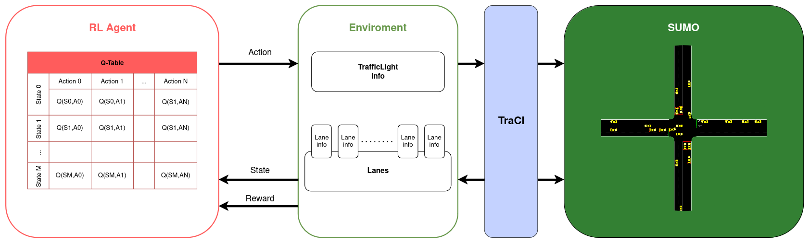
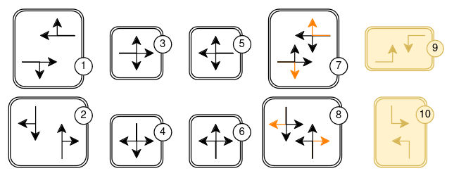

# TSC RL - Solución propuesta 
## Problema

La gestión ineficiente de los semáforos en una intersección causa problemas, como pueden ser tiempos de espera prolongados, que luego se propagan sobre la red de calles conectadas a la intersección. 

## Solución propuesta

Gestionar los semáforos de forma dinámica, teniendo en cuenta el estado de tráfico de la correspondiente intersección, puede conllevar a una mejora notable en los tiempos de espera de los vehículos. 

Para lograr este comportamiento, se propone plantear el problema en el marco del Reinforcement Learning, el cual consiste de dos elemento, el agente y el entorno.

El estudio se realizará sobre una intersección de 2 calles de 4 carriles, y para representar un entorno realista se utilizará [SUMO](https://eclipse.dev/sumo/). SUMO es un paquete de simulación de tráfico multimodal, microscópico y continuo y de de código abierto. Este ofrece la API TraCI, con la cual se obtendrá y enviará información entre el código y la simulación.

### MDP

El entorno se modelará mediante un Markov Decision Process (MDP). La cuadrupla <$\mathcal{S}$,$\mathcal{A}$,$\mathcal{P}$,$\mathcal{R}$>, dónde S denota el espacio de estados, A es el espacio de acciones, P es la matriz de probabilidad de transición de estado, y R es la función de recompensa.

#### Estados

Un estado $s \in \mathcal{S}$ se compone de 3 componentes:

- Fase actual del semáforo (8 o 10 valores). 
- Cantidad de vehículos detenidos **por cada calle** o **carril** (3 a 10 valores/intervalos). En el caso de la intersección utilizada, serían 4.
- Tiempo de espera promedio **por cada calle** o **carril**. (3 a 10 valores/intervalos). En el caso de la intersección utilizada, serían 4.

Tanto la cantidad de vehículos detenidos, como el tiempo de espera promedio requieren procesarse por alguna función de discretización. La cantidad de intervalos se evaluará en la experimentación, en principio se realizarán pruebas categorizando en los intervalos marcados (3-10 intervalos).

#### Acciones
El agente controlador de semáforos necesita seleccionar una acción apropiada al estado de tráfico actual de la intersección. Una acción $a \in \mathcal{A}$ puede tomar los siguientes valores:

1) $rrrrGGGrrrrrGGGr$
2) $GGGrrrrrGGGrrrrr$
3) $rrrrrrrrrrrrGGGG$
4) $GGGGrrrrrrrrrrrr$
5) $rrrrGGGGrrrrrrrr$
6) $rrrrrrrrGGGGrrrr$
7) $rrrrGGGgrrrrGGGg$
8) $GGGgrrrrGGGgrrrr$

Cuando se elije la próxima acción, el paso previo al cambio es: transicionar a la correspondiente **fase amarilla**. Siguiendo la enumeración anterior de cada fase posible, estas son las correspondientes fases amarillas:

1) $rrrryyyrrrrryyyr$
2) $yyyrrrrryyyrrrrr$
3) $rrrrrrrrrrrryyyy$
4) $yyyyrrrrrrrrrrrr$
5) $rrrryyyyrrrrrrrr$
6) $rrrrrrrryyyyrrrr$
7) $rrrryyyyrrrryyyy$
8) $yyyyrrrryyyyrrrr$

Cada caracter/letra de una estado (también acción) de una fase describe el estado de una señal del semáforo. Tenga en cuenta que un mismo carril puede contener varias señales, por ejemplo, una para los vehículos que giran a la izquierda y otra para los que siguen recto. Esto significa que una señal no controla carriles, sino **enlaces**, cada uno de los cuales conecta un carril que entra en un cruce con otro que sale de él.

Son 16 señales de enlace (representado por el caracter) y el orden de cada señal del enlace va en sentido horario. Comienza desde el enlace 0: ***carril entrante norte derecho ⟶ carril saliente oeste derecho*** y termina en el enlace 15: ***carril entrante oeste izquierdo ⟶ carril saliente norte izquierdo***.

A continuación, una descripción de cada señal posible:

| Caracter | Descripción |
|-----------|-------------|
| r         | 'luz roja' para una señal - los vehículos deben detenerse |
| y         | 'luz amarilla' para una señal - los vehículos comenzarán a desacelerar si están lejos de la intersección, de lo contrario, pasan |
| g         | 'luz verde' para una señal, sin prioridad - los vehículos pueden pasar la intersección si ningún vehículo utiliza un flujo enemigo con mayor prioridad, de lo contrario, desaceleran para dejarlo pasar. Siempre desaceleran al acercarse hasta que estén dentro de la distancia de visibilidad configurada |
| G         | 'luz verde' para una señal, con prioridad - los vehículos pueden pasar la intersección |

#### Q-Table

La Q-table utilizada por el agente tendrá las siguientes dimensiones: 

$$(4^{(h\_int)}\cdot4^{w\_int}\cdot|\mathcal{A}|)\cdot|\mathcal{A}|$$

dónde $h\_int$ y $w\_int$ son la cantidad de intervalos usados para discretizar *cantidad de vehiculos detenidos por carill* y *tiempos de espera promedio por carril*, respectivamente. $|\mathcal{A}|$ es la cantidad de fases posibles.

Para localizar una fila (estado) en la tabla, es necesario aplicar una función de *hash* sobre los componentes que representan al estado observado.

#### Función de Recompensa
Sea $t$ el instante de tiempo actual, $L$ la cantidad de carriles (o calles), $N_l$ la cantidad de vehículos detenidos en el carril $l$, y $w_{l_i}$ el tiempo de espera del vehículo $i$ en el carril $l$. $W_t$ es el tiempo total de espera en el instante $t$, definido como:

$$W_t = \sum_{l=1}^{L} \sum_{i=1}^{N_l} w_{l_i}$$

Entonces, el tiempo de espera acumulado en el instante $t$ respecto al instante $t-1$ se calcula como:

$$ R_t = W_{t} - W_{t-1}$$

### Métricas
Para evaluar el desempeño y aprendizaje del Q-Agent se utilarán las siguientes métricas:

- Recompensa acumulada

- Tiempo de espera promedio

