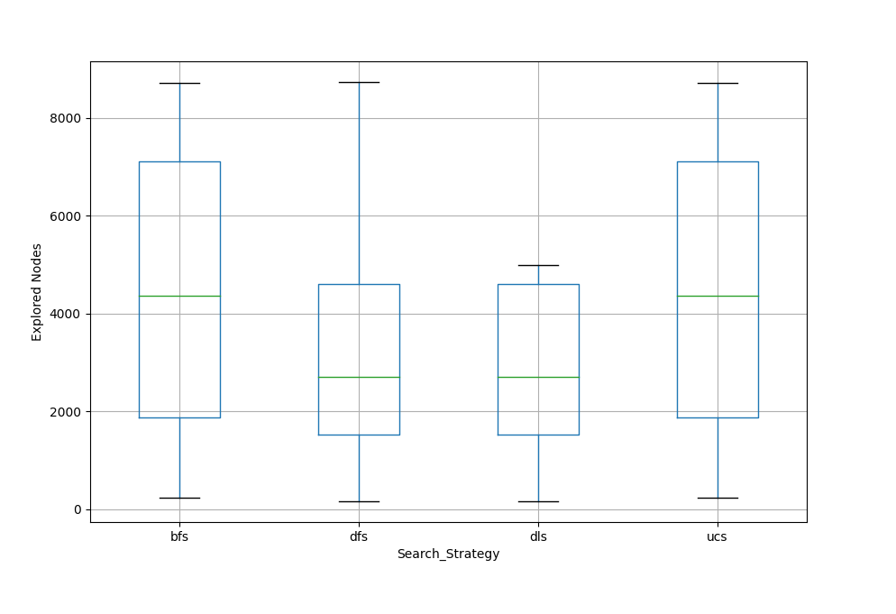

## **Búsquedas no informadas** 

**Problema**: encontrar agente basado en objetivos, que dado un punto de inicio y un punto destino, encuentre el camino óptimo.  

El entorno del agente está compuesto por una grilla de 100x100 en dónde los obstáculos se generan al azar. Se trata de un entorno completamente observable, determinista y estático.  

Las **acciones** posibles del agente son: arriba, abajo, izquierda y derecha.  

El agente resolverá el problema mediante los siguientes algoritmos:  
+ Breadth First Search (BFS),
+ Uniform Cost Search (UCS),
+ Depth First Search (DFS),
+ Depth Limited Search (DLS).  

### **Resultados**
Teniendo en cuenta los mencionados algoritmos, se ejecutaron 30 veces cada uno, en un escenario aleatorio con una tasa de obstáculos del 10%. La posición inicial y el destino del agente también son seleccionados de forma aleatoria.  
A partir de la variable aleatoria discreta **X="Cantidad de nodos explorados"** se obtuvieron las siguientes medidas.

#### **Tendencia central**  

   

|Algoritmo|Media      |
|---------|-----------|
|**BFS**  |4494.5     |
|**UCS**  |4494.5     |
|**DFS**  |3131.233333|
|**DLS**  |2845.1     |

   

#### **Dispersión**

   

|Algoritmo|Desviación estándar|
|---------|-------------------|
|**BFS**  |2805.121151        |
|**UCS**  |2805.121151        |
|**DFS**  |2192.021531        |
|**DLS**  |1690.109022        |

   

#### **Gráfico de caja y bigote. Por estrategia de búsqueda**

   

### **Conclusiones**
Teniendo en cuenta el **problema plantado**:
> Encontrar un agente basado en objetivos, que dado un punto de inicio y un punto destino, encuentre el camino óptimo.  

Los algoritmos adecuados para encontrar el camino óptimo son: **Breadth First Search** (si el costo de cualquier movimiento es constante en todos los nodos) y **Uniform Cost Search** (si el costo de moverse de un nodo a otro es variable).  

En ambos, la primera vez que un nodo es descubierto durante el recorrido, la distancia desde el origen nos da el camino más corto.

