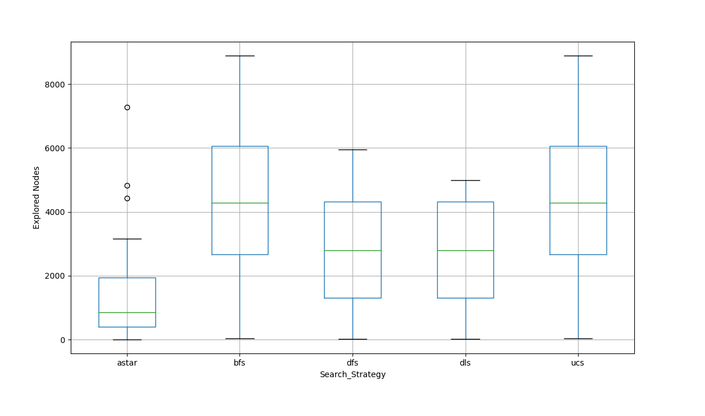

## **Búsquedas informadas** 

**Problema**: encontrar agente basado en objetivos, que dado un punto de inicio y un punto destino, encuentre el camino óptimo.  

El entorno del agente está compuesto por una grilla de 100x100 en dónde los obstáculos se generan al azar. Se trata de un entorno completamente observable, determinista y estático.  

Las **acciones** posibles del agente son: arriba, abajo, izquierda y derecha.  

El agente resolverá el problema utilizando el algoritmo **A\* (A estrella)**.
Luego se compararán los resultados obtenidos mediante A* y los siguientes algoritmos (previamente analizados en [tp3-busquedas-no-informadas](https://github.com/juanm4morales/ia-uncuyo-2022/tree/main/tp3-busquedas-no-informadas)):

+ Breadth First Search (BFS),
+ Uniform Cost Search (UCS),
+ Depth First Search (DFS),
+ Depth Limited Search (DLS). Limitado a la mitad de casillas del entorno.

### **Resultados**
Teniendo en cuenta los mencionados algoritmos, se ejecutaron 30 veces cada uno, en un escenario aleatorio con una tasa de obstáculos del 10%. La posición inicial y el destino del agente también son seleccionados de forma aleatoria.  
A partir de la variable aleatoria discreta **X="Cantidad de nodos explorados"** se obtuvieron las siguientes medidas.

#### **Tendencia central**  

   

| Algoritmo            | Promedio                   |
| -------------------- | -------------------------- |
| **A\***              | 1458,76666666667           |
| **BFS**              | 4259,63333333333           |
| **DFS**              | 2901,6                     |
| **DLS**              | 2821,06666666667           |
| **UCS**              | 4259,63333333333           |

   

#### **Dispersión**

   

| Algoritmo        | Desviación estándar |
| ---------------- | ------------------- |
| **A\***          | 1659,94833079814    |
| **BFS**          | 2533,7556897622     |
| **DFS**          | 1806,46079201943    |
| **DLS**          | 1686,24056314086    |
| **UCS**          | 2533,7556897622     |

   

#### **Gráfico de caja y bigote. Por estrategia de búsqueda**

   

### **Conclusiones**
Teniendo en cuenta el **problema plantado**:
> Encontrar un agente basado en objetivos, que dado un punto de inicio y un punto destino, encuentre el camino óptimo.  

El algoritmo **A\*** es el más adecuado para encontrar el camino óptimo. Añadirle heurística a un agente basado en objetivos mejora notablemente la rapidez con la que encuentra el objetivo.