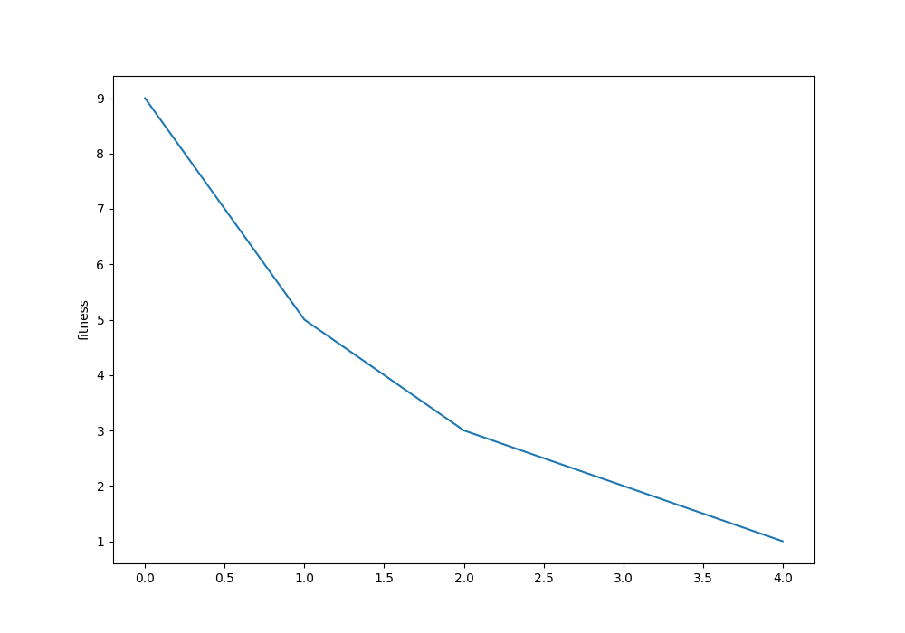

# **Búsquedas locales. Problema N-Reinas**

  
***Figura 1**: Una de las posibles soluciones al problema de las 8 reinas*  

   

Se usaron 3 algoritmos de búsqueda local para encontrar **una solución** al problema de las n reinas. Estos algoritmos son:

+ **Hill Climbing**
+ **Simulated Annealing**
+ **Algoritmo genético**  

**Función de fitness**  
Este es un problema de minimización de la cantidad de reinas que se encuentran amenazadas. La función de fitness retorna la cantidad de pares de reinas amenazadas, y a partir de esta se intentará reducir su valor (de ser posible a 0) utilizando los algoritmos en estudio.  
    

## **Implementación de algoritmos**

### **Hill Climbing**

Se utilizó la versión *clásica* de Hill Climbing.

  
***Figura 2**: Pseudocódigo de algoritmo Hill Climbing*  

   

### **Simulated Annealing**

Tiene una **cantidad máxima de estados de búsqueda** = **n**, la cuál también sirve como parámetro para la función de reducción de temperatura *schedule*. Esta cantidad depende del tamaño del problema, y está determinada por la siguiente fórmula.

    n = int((10/4)*self.size**3)

dónde self.size es el tamaño del problema (cantidad de reinas).

Se eligió una temperatura inicial constante para cualquier tamaño del problema. 

    INITIAL_TEMPETURE=4.0

**Función schedule**: la función elegida tiene un decremento cuadrático, el cual depende del tiempo *t*, de la temperatura inicial (*INITIAL_TEMPETURE*) y de la cantidad máxima de estados *n*:

    INITIAL_TEMPETURE*((n-t)/n)**2

  
***Figura 3**: Función de enfriamiento para n=8*  

Cuando el siguiente estado tiene un peor **fitness** que el anterior, este se acepta con probabilidad

$$ p = {e^{-\Delta E/T}} $$

En la siguiente figura se observa como disminuye la probabilidad de seleccionar un estado con peor fitness a medida que t aumenta.

***Figura 4**: Función de probabilidad para n=8*  

 

### **Algoritmo genético**

   

+ **Tamaño de la población**: El tamaño de la población depende del tamaño del problema **n**. La fórmula utilizada para seleccionar este tamaño es:

$$ size_{population} = {n*(n-1)} $$

+ **Selección**: **Selección proporcional**. Se seleccionan pares de padres con una probabilidad proporcional al fitness de los individuos. La selección es **con reemplazo**, y se finaliza una vez que la nueva población tenga el tamaño seleccionado.

+ **Cruzamiento**: **Crossover de 1 punto**. Se selecciona aleatoriamente un punto de cruce, y luego se cortan los dos individuos seleccionados en este punto. Para luego invertir sus partes y generar **2 hijos**. 

+ **Mutación**: la probabilidad inicial de que un individuo mute es:  

        MUTATION_RATE=0.05

    Esta cambiará si el algoritmo *"se atasca*".  
    La mutación implica modificar aleatoriamente **1 solo gen** (seleccionado al azar) del individuo.

+ **Manejador de atascos**. Arbitrariamente se decidió que el algoritmo genético se atasca cuando:  

    $$ Generaciones Sin Mejora >  size_{population}*10$$

    Una vez se supere esta cantidad de generaciones que no mejoran su fitness, el **manejador de atascos** aumentará la probabilidad de que un individuo mute. Una vez que el fitness mejore, se restaurá la probabilidad de mutación a la inicial.
        
        # <jam handler>
        if stuckness>=maxStuckness:
            if stuckness==maxStuckness:
                mutationRate=mutationRate*2
            elif stuckness==maxStuckness*2:
                mutationRate=mutationRate*2
            elif stuckness==maxStuckness*3:
                mutationRate=mutationRate*2
        if minHPop<minHAchieved:
            minHAchieved=minHPop
            mutationRate=MUTATION_RATE
            stuckness=0
        else:
            stuckness+=1
        # </jam handler>

+ **Condición de parada**: encontrar **solución óptima**. El algoritmo no se detiene hasta no encontrar al menos un individuo en su población actual que tenga un **fitness=0**.

## **Resultados obtenidos**

### **Porcentaje de veces que se llega a un estado de solución óptimo**  

| Algoritmo           | 4 reinas    | 8 reinas | 10 reinas| 12 reinas| 15 reinas|
|---------------------|-------------|----------|----------|----------|----------|
| Algoritmo genetico  | 100,00 %    | 100,00 % | 100,00 % | 100,00 % | 100,00 % |
| Hill Climbing       | 40,00 %     | 6,67 %   | 6,67 %   | 6,67 %   | 3,33 %   |
| Simulated annealing | 90,00 %     | 60,00 %  | 13,33 %  | 30,00 %  | 10,00 %  |

### **Tiempo de ejecución promedio**  

   

| Algoritmo           |4 reinas |8 reinas | 10 reinas| 12 reinas  |15 reinas|
|---------------------|---------|---------|----------|------------|---------|
| Algoritmo genetico  | 0,01432 | 0,91482 | 13,23120 | 5,17100    | 15,26157|
| Hill Climbing       | 0,00014 | 0,00312 | 0,00956  | 0,02306    | 0,07121 |
| Simulated annealing | 0,00057 | 0,01746 | 0,05998  | 0,13021    | 0,38979 |

### **Desviación estándar del tiempo de ejecución**  
   

| Algoritmo           |4 reinas |8 reinas |10 reinas |12 reinas|15 reinas |
|---------------------|---------|---------|----------|---------|----------|
| Algoritmo genetico  | 0,01746 | 2,54879 | 31,73952 | 6,63408 | 27,91593 |
| Hill Climbing       | 0,00004 | 0,00080 | 0,00210  | 0,00496 | 0,01106  |
| Simulated annealing | 0,00044 | 0,00712 | 0,00829  | 0,02270 | 0,04353  |

### **Promedio de estados alcanzados antes de encontrar solución (no óptima)**  
   

| Algoritmo           | 4 reinas | 8 reinas | 10 reinas | 12 reinas | 15 reinas |
|---------------------|----------|----------|-----------|-----------|-----------|
| Algoritmo genetico  | 16,77    | 149,33   | 1075,57   | 206,90    | 274,00    |
| Hill Climbing       | 2,67     | 4,03     | 5,00      | 5,93      | 7,63      |
| Simulated annealing | 56,90    | 912,70   | 2377,30   | 3908,53   | 8146,00   |

### **Desviación estándar de la cantidad de estados alcanzados antes de encontrar solución (no óptima)**  
   

| Algoritmo           | 4 reinas | 8 reinas  | 10 reinas  | 12 reinas | 15 reinas | Total Resultado |
|---------------------|----------|-----------|------------|-----------|-----------|-----------------|
| Algoritmo genetico  | 18,50384 | 415,86141 | 2663,13506 | 241,66839 | 457,15492 | 1268,01608      |
| Hill climbing       | 0,95893  | 1,18855   | 1,14470    | 1,46059   | 1,24522   | 2,06858         |
| Simulated annealing | 48,18166 | 373,54916 | 338,12333  | 680,46301 | 908,78088 | 2914,02062   
   

### **Distribución del tiempo de ejecución por algoritmo mediante diagramas de caja y bigote**  

    

***Figura 5**: Boxplots del tiempo de ejecución para n=4,8,10*  

   

***Figura 5**: Boxplots del tiempo de ejecución para n=12,15*  

   

### **Variación de la función fitness (h)**
   

#### **Hill Climbing**

***Figura 7**: Función fitness en Hill Climbing para n=8* 

   

#### **Simulated Annealing**

***Figura 8**: Función fitness en Simulated Annealing para n=8*  
   

#### **Algoritmo Genético**
De toda la población se selecciona el fitness del **mejor individuo**de la generación.  

***Figura 9**: Función fitness en Algoritmo Genético para n=8*  
   

## Conclusiones

Para el problema particular de las N-Reinas, el mejor algoritmo a usar es el **algoritmo genético**. Debido a que siempre encuentra la solución óptima (de la forma planteada), aunque tenga un coste de tiempo que crece de forma polinómica en cuanto el tamaño del problema aumenta. Pese a esto el código se puede paralelizar y disminuir el tiempo de ejecución.  

Utilizando una función de enfriamiento que decrezca la temperatura *muy lentamente*, es posible encontrar un óptimo global con **simulated annealing**. Esto implica un tiempo de ejecución muy alto, y frente a un algoritmo genético, no es superior para encontrar un mínimo global, ya que la paralelización que ofrece el algoritmo genético es una gran ventaja frente a este.