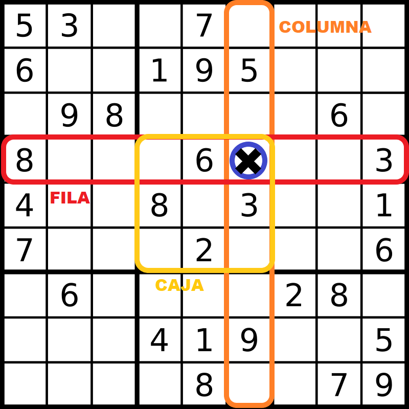
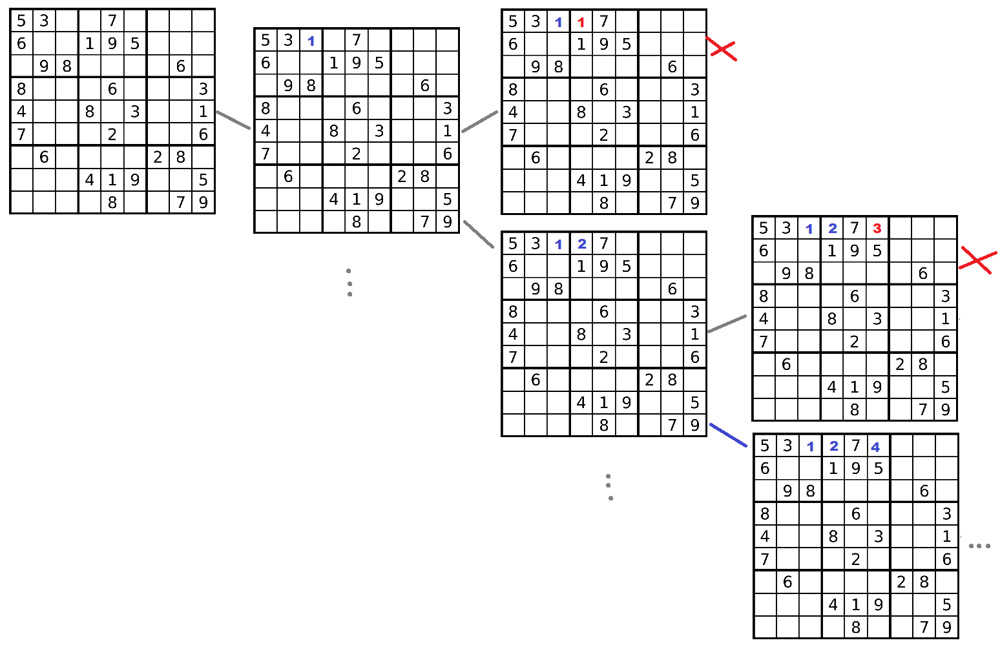
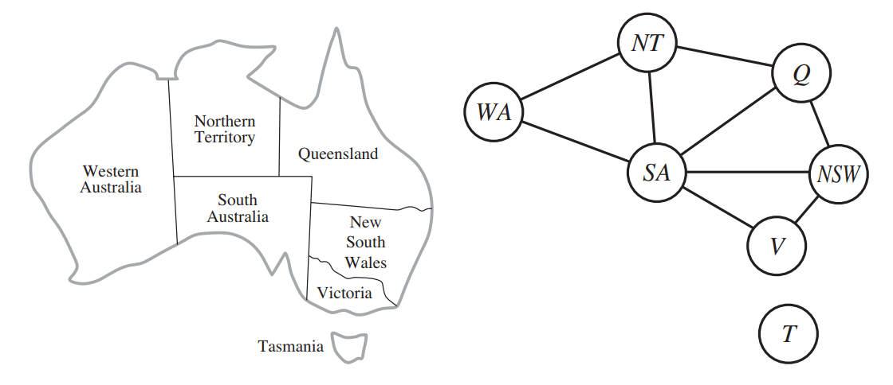
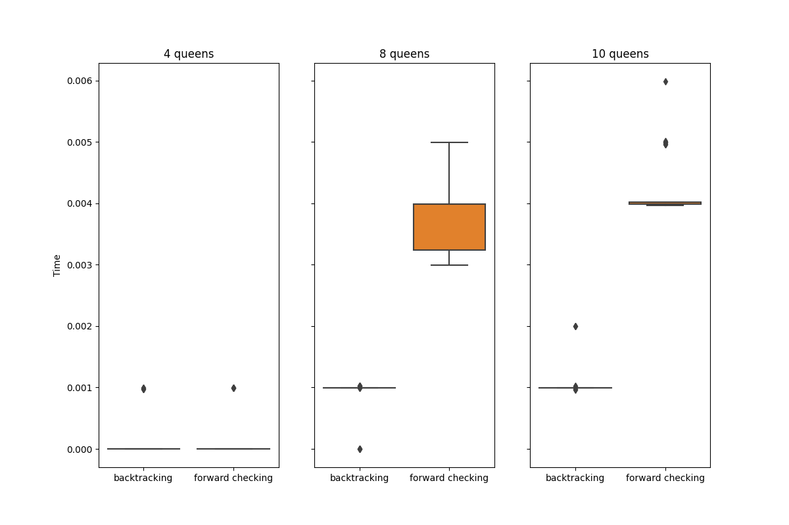
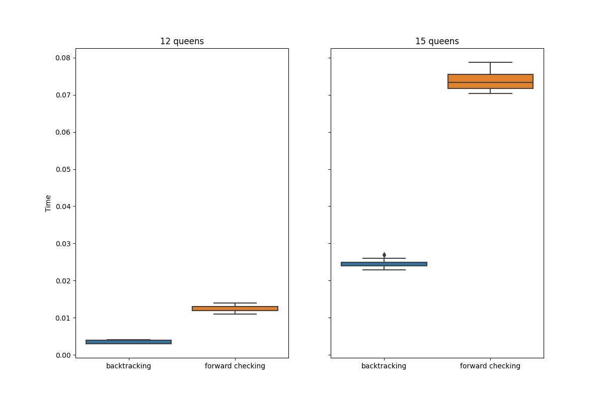
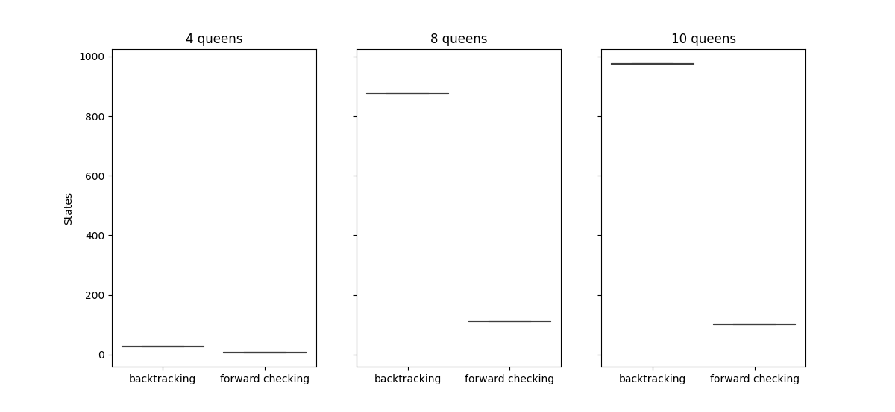
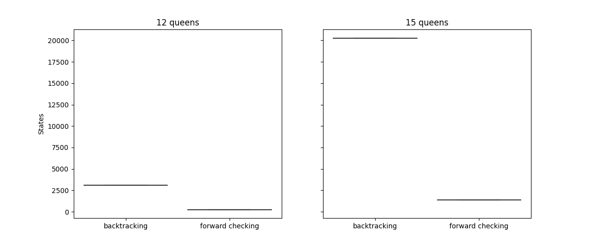

## **Ejercicio 1**: Sudoku como un CSP
Un tablero de Sudoku conisten en 81 celdas, de las cuales algunas se encuentran inicialmente asignadas a un valor que puede ir desde 1 hasta 9. El objetivo es llenar las restantes celdas vacías de forma tal de que un dígito no aparezca más de una vez por fila, columna, o en una de las 9 regiones de 3x3 del tablero.  

Consideraremos al juego del Sudoku como un CSP identificando estos 3 componentes:  

+ **Variables**: celdas vacías en el tablero de sudoku.  
+ **Dominio**: para vada celda, el dominio es el conjunto {1,2,3,4,5,6,7,8,9}.  
+ **Restricciones**:  

    + Una variable no puede tener asignado un valor más de una vez en la misma fila.  
    + Una variable no puede tener asignado un valor más de una vez en la misma columna.  
    + Una variable no puede tener asignado un valor más de una vez en la misma región.    

  


Representaremos el tablero mediante una matrix de tamaño 81. Inicialmente tendrá 

El algoritmo principal para la búsqueda de la solución es **Backtracking**. Nos movemos en profundidad observando que no se violen las restricciones establecidas. Si no se viola ninguna restricción seguimos moviendonos hacia abajo del árbol de búsqueda.  

  

*Ejemplo de backtracking con un tablero de sudoku de 4x4*  

<br>  


    function BACKTRACKING-SEARCH(csp) returns a solution, or failure
        return BACKTRACK({}, csp) 

    function BACKTRACK(assignment, csp) returns a solution, or failure
        if assignment is complete then return assignment
        var ← SELECT-UNASSIGNED-VARIABLE(csp)
        for each value in ORDER-DOMAIN-VALUES(var, assignment, csp) do
            if value is consistent with assignment then
                add {var = value} to assignment
                inferences ← INFERENCE(csp, var, value)
                if inferences != failure then
                    add inferences to assignment
                    result ← BACKTRACK(assignment, csp)
                    if result != failure then
                        return result
            remove {var = value} and inferences from assignment
    return failure

Para la selección de variables y asignación de valores del dominio implementaremos heurísticas que nos ayuden a resolver el problema más rápido.

**SELECT-UNASSIGNED-VARIABLE(csp)**  
Para seleccionar una variable, una heurística apropiada al problema del Sudoku es seleccionar la próxima variable (celda) con la **cantidad mínima de valores legales** (*menor cantidad de candidatos*). Si hay más de una se elige la cual tenga más variables que dependan de ella (**mayor grado**). **MVC + MD**.  

**ORDER-DOMAIN-VALUES**  
Una vez que seleccionamos nuestra variable (celda), a esta le asignaremos un valor basandonos en cuanto va a afectar los dominios de los vecinos. Seleccionaremos aquella que cause la menor cantidad de restricciones de dominio. Por ejemplo, si en una celda tenemos las posibilidades 7 y 9, observaremos que tantas veces aparece una de estas en las celdas vecinas, luego elegimos el valor que menos aparezca en los dominios delas celdas vecinas. **LCV**  
<br>  

## **Ejercicio 2**  
Utilizar el algoritmo AC-3 para demostrar que la arco consistencia puede detectar la
inconsistencia de la asignación parcial {WA=red, V=blue} para el problema del colorear el
mapa de Australia.  


  

*Mapa con principales estados y territorios de Australia. Y representación de las restricciones mediante grafo*  

Con una asignación inicial {WA=rojo, V=azul}, los dominios de nuestras variables WA, NT, SA, Q, NSW, V serán los siguientes:  

  

*Dominio inicial del CSP*  

Procedemos a ejecutar el algoritmo AC-3 registrando las variables y retornos más importantes, en cada iteración.  

|Iteración|Cola                                                                                                                                       |(Xi,Xj) |CONSISTENTE|D(WA)|D(NT)  |D(SA)  |D(Q)   |D(NSW) |D(V)|
|---------|-------------------------------------------------------------------------------------------------------------------------------------------|--------|-----------|-----|-------|-------|-------|-------|----|
|0        |{(WA,NT),(NT,WA),(WA,SA),(SA,WA),(NT,SA),(SA,NT),(NT,Q),(Q,NT),(SA,Q),(Q,SA),(Q,NSW),(NSW,Q),(SA,V),(V,SA),(NSW,V),(V,NSW)}                |-       |-          |R    |(R,V,A)|(R,V,A)|(R,V,A)|(R,V,A)|A   |
|1        |{(NT,WA),(WA,SA),(SA,WA),(NT,SA),(SA,NT),(NT,Q),(Q,NT),(SA,Q),(Q,SA),(Q,NSW),(NSW,Q),(SA,V),(V,SA),(NSW,V),(V,NSW)}                        |(WA,NT) |SI         |R    |(R,V,A)|(R,V,A)|(R,V,A)|(R,V,A)|A   |
|2        |{(WA,SA),(SA,WA),(NT,SA),(SA,NT),(NT,Q),(Q,NT),(SA,Q),(Q,SA),(Q,NSW),(NSW,Q),(SA,V),(V,SA),(NSW,V),(V,NSW)}+{(SA,NT),(Q,NT)}               |(NT,WA) |NO         |R    |(V,A)  |(R,V,A)|(R,V,A)|(R,V,A)|A   |
|3        |{(SA,WA),(NT,SA),(SA,NT),(NT,Q),(Q,NT),(SA,Q),(Q,SA),(Q,NSW),(NSW,Q),(SA,V),(V,SA),(NSW,V),(V,NSW),(SA,NT),(Q,NT)}                         |(WA,SA) |SI         |R    |(V,A)  |(R,V,A)|(R,V,A)|(R,V,A)|A   |
|4        |{(NT,SA),(SA,NT),(NT,Q),(Q,NT),(SA,Q),(Q,SA),(Q,NSW),(NSW,Q),(SA,V),(V,SA),(NSW,V),(V,NSW),(SA,NT),(Q,NT)}+{(NT,SA),(Q,SA),(NSW,SA),(V,SA)}|(SA,WA) |NO         |R    |(V,A)  |(V,A)  |(R,V,A)|(R,V,A)|A   |
|5        |{(SA,NT),(NT,Q),(Q,NT),(SA,Q),(Q,SA),(Q,NSW),(NSW,Q),(SA,V),(V,SA),(NSW,V),(V,NSW),(SA,NT),(Q,NT),(NT,SA),(Q,SA),(NSW,SA),(V,SA)}          |(NT,SA) |SI         |R    |(V,A)  |(V,A)  |(R,V,A)|(R,V,A)|A   |
|6        |{(NT,Q),(Q,NT),(SA,Q),(Q,SA),(Q,NSW),(NSW,Q),(SA,V),(V,SA),(NSW,V),(V,NSW),(SA,NT),(Q,NT),(NT,SA),(Q,SA),(NSW,SA),(V,SA)}                  |(SA,NT) |SI         |R    |(V,A)  |(V,A)  |(R,V,A)|(R,V,A)|A   |
|7        |{(Q,NT),(SA,Q),(Q,SA),(Q,NSW),(NSW,Q),(SA,V),(V,SA),(NSW,V),(V,NSW),(SA,NT),(Q,NT),(NT,SA),(Q,SA),(NSW,SA),(V,SA)}                         |(NT,Q)  |SI         |R    |(V,A)  |(V,A)  |(R,V,A)|(R,V,A)|A   |
|8        |{(SA,Q),(Q,SA),(Q,NSW),(NSW,Q),(SA,V),(V,SA),(NSW,V),(V,NSW),(SA,NT),(Q,NT),(NT,SA),(Q,SA),(NSW,SA),(V,SA)}                                |(Q,NT)  |SI         |R    |(V,A)  |(V,A)  |(R,V,A)|(R,V,A)|A   |
|9        |{(Q,SA),(Q,NSW),(NSW,Q),(SA,V),(V,SA),(NSW,V),(V,NSW),(SA,NT),(Q,NT),(NT,SA),(Q,SA),(NSW,SA),(V,SA)}                                       |(SA,Q)  |SI         |R    |(V,A)  |(V,A)  |(R,V,A)|(R,V,A)|A   |
|10       |{(Q,NSW),(NSW,Q),(SA,V),(V,SA),(NSW,V),(V,NSW),(SA,NT),(Q,NT),(NT,SA),(Q,SA),(NSW,SA),(V,SA)}                                              |(Q,SA)  |SI         |R    |(V,A)  |(V,A)  |(R,V,A)|(R,V,A)|A   |
|11       |{(NSW,Q),(SA,V),(V,SA),(NSW,V),(V,NSW),(SA,NT),(Q,NT),(NT,SA),(Q,SA),(NSW,SA),(V,SA)}                                                      |(Q,NSW) |SI         |R    |(V,A)  |(V,A)  |(R,V,A)|(R,V,A)|A   |
|12       |{(SA,V),(V,SA),(NSW,V),(V,NSW),(SA,NT),(Q,NT),(NT,SA),(Q,SA),(NSW,SA),(V,SA)}                                                              |(NSW,Q) |SI         |R    |(V,A)  |(V,A)  |(R,V,A)|(R,V,A)|A   |
|13       |{(V,SA),(NSW,V),(V,NSW),(SA,NT),(Q,NT),(NT,SA),(Q,SA),(NSW,SA),(V,SA)}+{(WA,SA),(NT,SA),(Q,SA),(NSW,SA)}                                   |(SA,V)  |NO         |R    |(V,A)  |V      |(R,V,A)|(R,V,A)|A   |
|14       |{(NSW,V),(V,NSW),(SA,NT),(Q,NT),(NT,SA),(Q,SA),(NSW,SA),(V,SA),(WA,SA),(NT,SA),(Q,SA),(NSW,SA)}                                            |(V,SA)  |SI         |R    |(V,A)  |V      |(R,V,A)|(R,V,A)|A   |
|15       |{(V,NSW),(SA,NT),(Q,NT),(NT,SA),(Q,SA),(NSW,SA),(V,SA),(WA,SA),(NT,SA),(Q,SA),(NSW,SA)}+{(Q,NSW),(SA,NSW)}                                 |(NSW,V) |NO         |R    |(V,A)  |V      |(R,V,A)|(R,V)  |A   |
|16       |{(SA,NT),(Q,NT),(NT,SA),(Q,SA),(NSW,SA),(V,SA),(WA,SA),(NT,SA),(Q,SA),(NSW,SA),(Q,NSW),(SA,NSW)}                                           |(V,NSW) |SI         |R    |(V,A)  |V      |(R,V,A)|(R,V)  |A   |
|17       |{(Q,NT),(NT,SA),(Q,SA),(NSW,SA),(V,SA),(WA,SA),(NT,SA),(Q,SA),(NSW,SA),(Q,NSW),(SA,NSW)}                                                   |(SA,NT) |SI         |R    |(V,A)  |V      |(R,V,A)|(R,V)  |A   |
|18       |{(NT,SA),(Q,SA),(NSW,SA),(V,SA),(WA,SA),(NT,SA),(Q,SA),(NSW,SA),(Q,NSW),(SA,NSW)}                                                          |(Q,NT)  |SI         |R    |(V,A)  |V      |(R,V,A)|(R,V)  |A   |
|19       |{(Q,SA),(NSW,SA),(V,SA),(WA,SA),(NT,SA),(Q,SA),(NSW,SA),(Q,NSW),(SA,NSW)}+{(WA,NT),(Q,NT)}                                                 |(NT,SA) |NO         |R    |A      |V      |(R,V,A)|(R,V)  |A   |
|20       |{(NSW,SA),(V,SA),(WA,SA),(NT,SA),(Q,SA),(NSW,SA),(Q,NSW),(SA,NSW),(WA,NT),(Q,NT)}+{(NT,Q),(NSW,Q)}                                         |(Q,SA)  |NO         |R    |A      |V      |(R,A)  |(R,V)  |A   |
|21       |{(V,SA),(WA,SA),(NT,SA),(Q,SA),(NSW,SA),(Q,NSW),(SA,NSW),(WA,NT),(Q,NT),(NT,Q),(NSW,Q)}+{(Q,NSW),(V,NSW)}                                  |(NSW,SA)|NO         |R    |A      |V      |(R,A)  |R      |A   |
|22       |{(WA,SA),(NT,SA),(Q,SA),(NSW,SA),(Q,NSW),(SA,NSW),(WA,NT),(Q,NT),(NT,Q),(NSW,Q),(Q,NSW),(V,NSW)}                                           |(V,SA)  |SI         |R    |A      |V      |(R,A)  |R      |A   |
|23       |{(NT,SA),(Q,SA),(NSW,SA),(Q,NSW),(SA,NSW),(WA,NT),(Q,NT),(NT,Q),(NSW,Q),(Q,NSW),(V,NSW)}                                                   |(WA,SA) |SI         |R    |A      |V      |(R,A)  |R      |A   |
|24       |{(Q,SA),(NSW,SA),(Q,NSW),(SA,NSW),(WA,NT),(Q,NT),(NT,Q),(NSW,Q),(Q,NSW),(V,NSW)}                                                           |(NT,SA) |SI         |R    |A      |V      |(R,A)  |R      |A   |
|25       |{(NSW,SA),(Q,NSW),(SA,NSW),(WA,NT),(Q,NT),(NT,Q),(NSW,Q),(Q,NSW),(V,NSW)}                                                                  |(Q,SA)  |SI         |R    |A      |V      |(R,A)  |R      |A   |
|26       |{(Q,NSW),(SA,NSW),(WA,NT),(Q,NT),(NT,Q),(NSW,Q),(Q,NSW),(V,NSW)}                                                                           |(NSW,SA)|SI         |R    |A      |V      |(R,A)  |R      |A   |
|27       |{(SA,NSW),(WA,NT),(Q,NT),(NT,Q),(NSW,Q),(Q,NSW),(V,NSW)}+{(NT,Q),(SA,Q)}                                                                   |(Q,NSW) |NO         |R    |A      |V      |A      |R      |A   |
|28       |{(WA,NT),(Q,NT),(NT,Q),(NSW,Q),(Q,NSW),(V,NSW),(NT,Q),(SA,Q)}                                                                              |(SA,NSW)|SI         |R    |A      |V      |A      |R      |A   |
|29       |{(Q,NT),(NT,Q),(NSW,Q),(Q,NSW),(V,NSW),(NT,Q),(SA,Q)}                                                                                      |(WA,NT) |SI         |R    |A      |V      |A      |R      |A   |
|30       |{(NT,Q),(NSW,Q),(Q,NSW),(V,NSW),(NT,Q),(SA,Q)}                                                                                             |(Q,NT)  |NO         |R    |A      |V      |-      |R      |A   |

Finalmente en la iteración nº 30, el dominio de Q (Queensland) queda vacío luego de detectar inconsistencia con el dominio de NT (Northern Territory). Por lo tanto el algoritmo finaliza retornado *False*, lo que significa que se detectó una inconsistencia en la asignación pacial {WA=rojo, V=azul}.  

   

*Dominio final del CSP*  
<br>  

## **Ejercicio 3**
**¿Cuál es la complejidad en el peor caso cuando se ejecuta AC-3 en un árbol estructurado
CSP?**  

AC-3 en árboles estructurados tiene una complejidad $O(nd^2)$, siendo *n* el número de variables (nodos) y *d* es el tamaño del dominio más grande. Para el árbol estructurado elegimos una variable como raíz, y luego un orden de las variables (nodos) tal que el padre de cada uno lo preceda en el orden.  
Luego al ejecutar AC-3 se evaluará la arco consistencia del padre del nodo con el mismo nodo en $n$ pasos, siguiendo un orden inverso al establecido. Como la complejidad de REVISE es como mucho $d^2$. Entonces $O(nd^2)$ es la complejidad de AC-3 en árboles estructurados.

<br>  

## **Ejercicio 4**

AC-3 coloca de nuevo en la cola todo arco $(Xj, Xi)$ cuando cualquier valor es removido del dominio de $Xi$ incluso si cada valor de $Xk$ es consistente con los valores restantes de $Xi$. Por cada arco $(Xi,Xj)$ llevaremos la cuenta del número de valores restantes de $Xi$ que sean consistentes con cada valor de $Xk$.  

Mediante el siguiente algoritmo AC-3 modificado lograremos evitar encolar arcos $(Xi, Xj)$ dónde cada valor de $Xk$ es consistente con los valores de $Xi$, luego de haber eliminado un valor del dominio de $Xi$.  


```
function AC-3(csp) returns false if an inconsistency is found and true otherwise
    inputs: csp, a binary CSP with components (X, D, C)
    local variables: queue, a queue of arcs, initially all the arcs in csp;
    remainToSatisfy, a 2d-array to store the number of remaining values that satisfies the constraint between variables

    remainToSatisfy ← INITIALIZE-PROBLEM(csp)
    while queue is not empty do
        (Xi, Xj)← REMOVE-FIRST(queue)
        value ← REVISE(csp, Xi, Xj)
        if value != NONE then
            if size of Di = 0 then return false
            for each Xk in Xi.NEIGHBORS do
                if Dk[value] = True // value is in the domain of Xk
                    remaintToSatisfy[Xk][Xi] ← remaintToSatisfy[Xk][Xi] - 1
                if Xk != Xj and remaintToSatisfy[Xk][Xi] != 0
                    add (Xk, Xi) to queue
    return true

function INITIALIZE-PROBLEM(csp) returns a 2d-array called remainToSatisfy
    inputs: csp, a binary CSP with components (X,D,C)
    local variables: arcs, a list of all the arcs in csp;
    counter, to count the remaining values that satisfies constraint;
    remainToSatisfy, a 2d-array to store the number of remaining values that satisfies the constraint between variables
    
    for each (Xi,Xj) in arcs do
        for each x in Di do
            counter ← 0
            for each y in Dj do
                if (x,y) dont satisfies the constraint between Xi and Xj then
                    counter ← counter +1
            remainToSatisfy[Xi][Xj] ← counter
    return remainToSatisfy

function REVISE(csp, Xi, Xj) returns the value that does not satisfy the constraint or NONE if is arc-consistent
    for each x in Di do
        for each y in Dj do
            if (x,y) dont satisfies the constraint between Xi and Xj then
                delete x from Di
                return x
    return NONE
```

Utilizaremos un **arreglo** de dos dimensiones ($remainToSatisfy$) para **almacenar** la cantidad de **valores que restan** para que **cada valor de $Xk$** sea **consistente** con **todos los valores de $Xi$**. Este arreglo será **inicializado al principio** (preprocesado), recorriendo todos los arcos (restricciones). El acceso a la cantidad de valores restantes de $X$ que quedan para que sean consistentes con cada valor de $Y$ lo representaremos así: $remainToSatisfy[X][Y]$.

Cada vez que borremos un valor $x$ del dominio de una variable $Xi$, y si un vecino $Xk$ presenta $x$ en su dominio, entonces a los arcos $(Xk,Xi)$ y $(Xi,Xk)$ le **restaremos una unidad** en su correspondiente contador. De esta podemos actualizar este número de manera eficiente.  

Y luego, si la cantidad de valores de $Xi$ que quedan por ser consistentes con todos los valores de los demás vecinos - {$Xj$} es distinto de cero, añadiremos el arco $(Xk,Xi)$ a la cola.

Con esta implementación, cada vez que se borre un valor del dominio de $Xi$, reducimos en 1 la cantidad de valores permitidos para cada arco $(Xk,Xi)$  


## **Ejercicio 5**
**Demostración de la correctitud del algoritmo CSP para árboles estructurados.  

El algoritmo para CSP´s en árboles estructurados inicialmemte elige una variable como raíz del árbol, se ordenarán linealmente todas las variables, de forma tal que cada variable aparezca después que su padre (**orden topológico**). Luego, en sentido inverso al orden establecido, lograremos arco consistencia dirigida entre el nodo padre y el nodo en cuestión. Una vez tengamos nuestro árbol con arco consistencia dirigida, asignaremos valores del dominio restante a cada variable del CSP.  
Ya que cada enlace desde un padre al hijo es arco consistente, sabemos que para cualquier valor que elijamos para el padre, quedará un valor válido a elegir para el hijo. Por lo tanto solo tendremos relaciones *padre-hijo* y no será necesario resolver más que la arco consistencia para garantizar n-consistencia (por las características del árbol), siendo n el número de nodos del árbol.

## **Ejercicio 6**
**Resultados** obtenidas de las soluciones al problema de las n-reinas utilizando una formulación CSP. Las dos soluciones son: utilizando **backtracking** y otra utilizando **forward checking**. Para 4, 8, 10, 12 y 15 reinas.  
Se realizaron 30 ejecuciones de cada algoritmo implementado y se recopilaron datos de los tiempos de ejecución y los estados (nodos del árbol de búsqueda) recorridos.

### **Tiempo de ejecución promedio**

|Algorithm       |4 queens            |8 queens   |10 queens  |12 queens  |15 queens  |
|----------------|--------------------|-----------|-----------|-----------|-----------|
|Backtracking    |0.000131249         |0.000867693|0.001063251|0.003292878|0.024688466|
|Dorward Checking|0.000132966         |0.003822263|0.004254047|0.01236403 |0.073597018|


### **Tiempos de ejecución por algoritmo mediante diagramas de caja y bigote**  

<br>
  

*Boxplots del tiempo de ejecución para n=4,8,10*  

  

*Boxplots del tiempo de ejecución para n=12,15*   
<br> 

### **Estados recorridos**

|Amount of states  |4 queens   |8 queens   |10 queens  |12 queens  |15 queens  |
|----------------- |-----------|-----------|-----------|-----------|-----------|
|Backtracking      |26         |876        |975        |3066       |20280      |
|Forward checking  |8          |113        |102        |261        |1359       |

<br>

### **Estados recorridos por algoritmo mediante diagramas de caja y bigote**  

<br>
  

*Boxplots de estados recorridos para n=4,8,10*  

  

*Boxplots de estados recorridos para n=12,15*  

