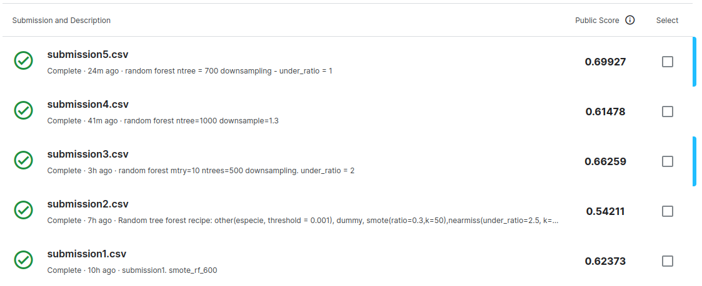

## Metodología utilizada

1º Se eliminaron las variables $ultima\_modificacion$, $diametro\_tronco$, $area\_seccion$, $nombre\_seccion$.  

2º Para balancear la clase $inclinacion\_peligrosa$ se probaron técninas de oversampling y downsampling, combinadas, y por separado. La técnica que logró mejores resultados fué hacer dowsampling. La clase mayoritaria se redujo exactamente a la cantidad de observaciones de la clase minoritaria (under_ratio = 1).  

3º Se eliminaron los niveles con menor información de la variable $especie$ para luego integrarlos todos en un nuevo nivel **others**.  

4º En un principio se realizó un análisis detallo sobre resultados obtenidos sobre un conjunto de validación, y también utilizando cross-validation en k-folds. Todo esto trataba de *tunear* hiperparámetros para random forest. Como los resultados obtenidos en Kaggle no fueron buenos, se descartaron esos resultados, y procedí con otra estrategia. Aquí el [workflow](https://juliasilge.com/blog/sf-trees-random-tuning/) el cual usé de guía.

5º Finalmente se aplicó **Random Forest** con los siguientes hiperparámetros: *mtry=2*, *ntrees=700*. Para el conjunto de datos preprocesado, de la forma descrita.  
   

### Resultados en Kaggle

  
*Submissions en Kaggle. Fecha: 20-11-22*