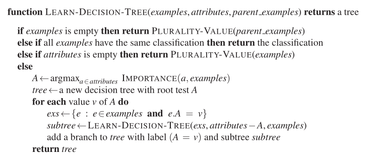

# Árboles de decisión
## Algoritmo ID3 (Iterative Dichotomiser 3)

El algoritmo se implementó en base al pseudocódigo que provee el libro AIMA 4º edición.  



## Resultados
Se probaron 1000 árboles generados a partir del dataset [tennis.csv](./code/id3/tennis.csv). En cada ejecución de *training*, dónde el ratio de sampling fúe de **0.8**, se obtuvo la métrica *accuracy*. 

Ejecución
```py
train = data.sample(frac=0.8)
test = data.drop(train.index)
tree=decisionTree(train,"play")
canPredict=predict(tree,test,"play")
if canPredict:
    y_true=test["play"].tolist()
    y_pred=test["prediction"].tolist()
    acc=accuracy_score(y_true,y_pred)
    sum+=acc # para el promedio
    i=i+1
```

Luego se obtuvo un promedio de *accuracy*, dando como resultado,  

$AVG\_accuracy = $ 0.7179.


## Estrategias para datos de tipo **real**

En un principio los algoritmos convencionales de árboles de decisión seleccionan una variable por vez, construyendo un árbol con una estructura inusualmente grande. Además, la selección de variables de forma greedy, aumenta enormemente la complejidad del modelo y la dificultad de implementación. Ejemplos de estos algoritmos son ID3 y C4.5. Sin embargo estas estrategias no lidian con variables de tipo **real**.

No fué hasta 1984, que surgió una metodología para tratar con variables continuas. CART (Classification and Regression Trees), son árboles que pueden construir **árboles de regresión con variables continuas**.  


Un árbol de regresión consiste en hacer preguntas de tipo ¿$x_{k}\leq c$? para cada una de las variables, de esta forma el espacio de las variables es dividio en hiper-rectángulos y todas las observaciones que queden dentro de un hiper-rectángulo tendrán el mismo valor estimado.
Se usa la ganancia de la suma de los errores cuadrados como criterio de división de un nodo.


## Referencias
[A Review of Decision Tree Classification
Algorithms for Continuous Variables](https://iopscience.iop.org/article/10.1088/1742-6596/1651/1/012083/pdf)

[Modelos Predictivos: Árboles de clasificación](https://fhernanb.github.io/libro_mod_pred/arb-de-regre.html)